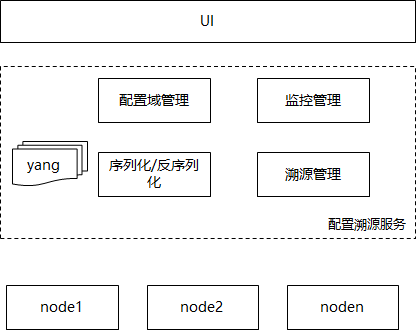

# gala-ragdoll

#### 介绍
gala-ragdoll是基于OS的配置托管服务，能够实现对OS配置的集群式管理，屏蔽不同OS类型的配置差异，实现统一的、可溯源的、预期配置可管理的可信的OS配置运维入口。

#### 软件架构

#### 安装教程

1. 安装依赖：`pip install -r requirements.txt`
2. 配置环境：编辑`config/gala-ragdoll.conf`文件，设置git目录和A-Ops接口地址
3. 启动服务：`python setup.py install`后运行`ragdoll`

#### 使用指导

1. 创建配置域：调用`/domain/createDomain`接口，传入JSON格式的域名和优先级
2. 添加纳管节点：调用`/host/addHost`接口，传入域名和节点信息
3. 添加配置文件：调用`/management/addManagementConf`接口，传入域名和配置文件路径及内容
4. 查询实际配置：调用`/confs/queryRealConfs`接口，传入域名和节点ID
5. 查询预期配置：调用`/confs/queryExpectedConfs`接口
6. 配置校验：调用`/confs/getDomainStatus`接口，获取同步状态
7. 配置同步：调用`/confs/syncConf`接口，同步预期配置到节点

#### 参与贡献

1. Fork 本仓库
2. 新建 Feat_xxx 分支
3. 提交代码
4. 新建 Pull Request

#### 开发者指南

1. 准备配置文件：确认配置文件路径和内容，检查文件类型是否支持
2. 准备yang文件：按照“特性/配置文件/配置项”的维度编写yang模型，定义path、type和spacer拓展字段
3. 准备解析脚本：实现从配置文件到object的转换逻辑，支持ini、json等格式
4. 功能测试：使用`test/test_yang.py`和`test/test_analy.py`验证yang模型和解析逻辑

#### 技术文档

- [设计文档](doc/design.md)
- [开发指南](doc/development_guidelines.md)
- [使用手册](doc/instruction_manual.md)

#### 许可证
本项目采用Mulan PSL v2许可证
