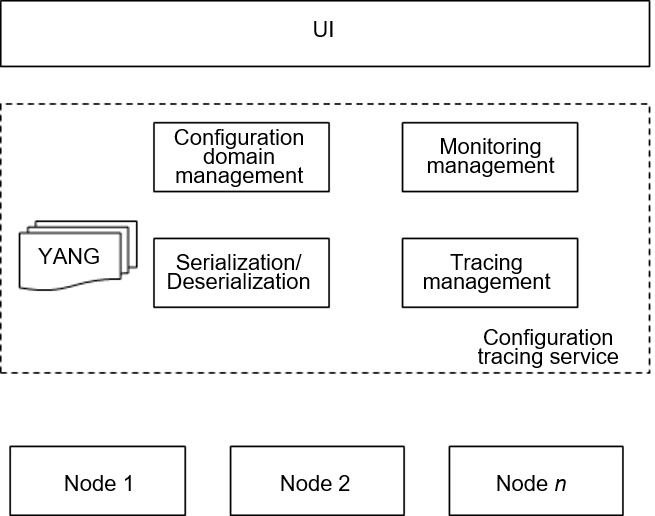

# gala-ragdoll

## Introduction

gala-ragdoll is an OS-level configuration management service. It provides a unified, traceable, and trusted OS configuration O&M portal to manage OS configurations in a cluster and masks configuration differences of various OS types.

## Software Architecture

## Installation

1. Install dependencies: Run `pip install -r requirements.txt`.
2. Configure the environment: Edit the `config/gala-ragdoll.conf` file and set the Git directory and A-Ops API address.
3. Start the service: Run `python setup.py install` and then `ragdoll`.

## Instructions

1. Create a configuration domain: Call the `/domain/createDomain` API and pass the domain name and priority in JSON format.
2. Add a managed node: Call the `/host/addHost` API and pass the domain name and node information.
3. Add a configuration file: Call the `/management/addManagementConf` API and pass the domain name, configuration file path, and content.
4. Query the actual configuration: Call the `/confs/queryRealConfs` API and pass the domain name and node ID.
5. Query the expected configuration: Call the `/confs/queryExpectedConfs` API.
6. Verify the configuration: Call the `/confs/getDomainStatus` API to obtain the synchronization status.
7. Synchronize the configuration: Call the `/confs/syncConf` API to synchronize the expected configuration to the node.

## How to Contribute

1. Fork this repository.
2. Create a Feat_*xxx* branch.
3. Commit code.
4. Create a pull request (PR).

## Developer Guide

1. Prepare the configuration file: Confirm the path and content of the configuration file and check whether the file type is supported.
2. Prepare the YANG file: Compile the YANG model following the hierarchy of feature/configuration file/configuration item and define the extended fields **path**, **type**, and **spacer**.
3. Prepare the parsing script: Implement the conversion logic from the configuration file to the object. The INI and JSON formats are supported.
4. Test the function: Use `test/test_yang.py` and `test/test_analy.py` to verify the YANG model and parsing logic.

## Technical Documents

- [Design Document](doc/design.md)
- [Development Guidelines](doc/development_guidelines.md)
- [Instruction Manual](doc/instruction_manual.md)

## Licensing

This project is licensed under Mulan PSL v2.
